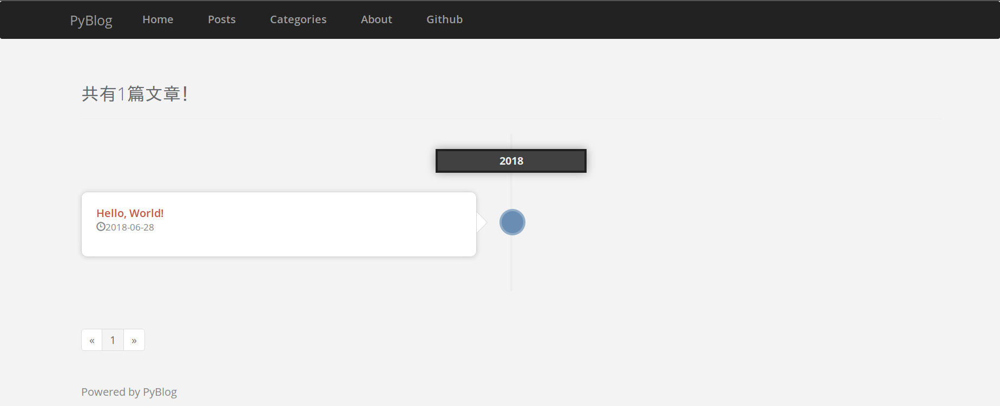

# PyBlog
## 运行环境
+ Windows / Linux / macOS and so on...
+ python 3
+ MySQL 5+

## 安装说明
命令行
```
~ git clone https://github.com/CHYbeta/PyBlog.git
~ cd PyBlog/
~ python3 -m pip install -r requirements.txt
~ python3 manager.py create_db
~ python3 manager.py create_user
~ python3 manager.py runserver
```

打开浏览器： http://127.0.0.1:5000/ 

默认后台地址： http://127.0.0.1/login

默认超级管理员账号/密码： admin@pyblog.com/admin

## 界面预览
主界面


文章列表


文章查看


后台登录


后台主界面


后台用户管理


后台文章管理
